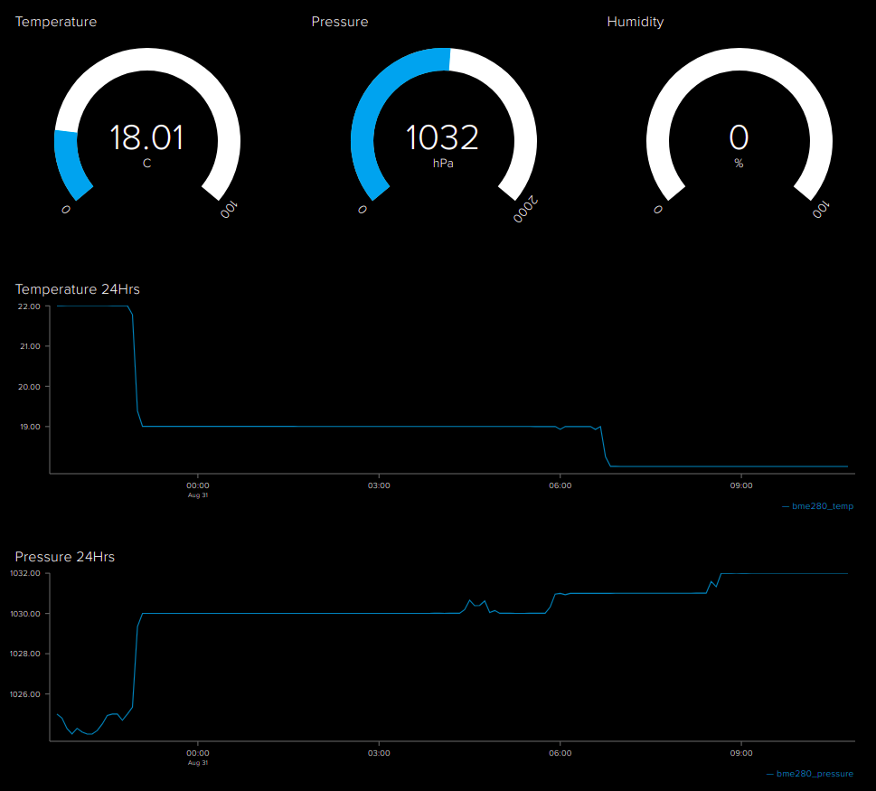

# LoPy BME280

A minimal micropython script for [LoPy](https://pycom.io) boards that reads the `Temperature` / `Humidity` / `Pressure` and posts it to [Adafruit](http://io.adafruit.com).

## Usage

- Make a copy of `scripts/config_example.py` and rename it to `scripts/example.py`
- Fill in your `WiFi credentials` and `Adafruit credentials`.
- Upload the code to LoPy.

## Dashboard

